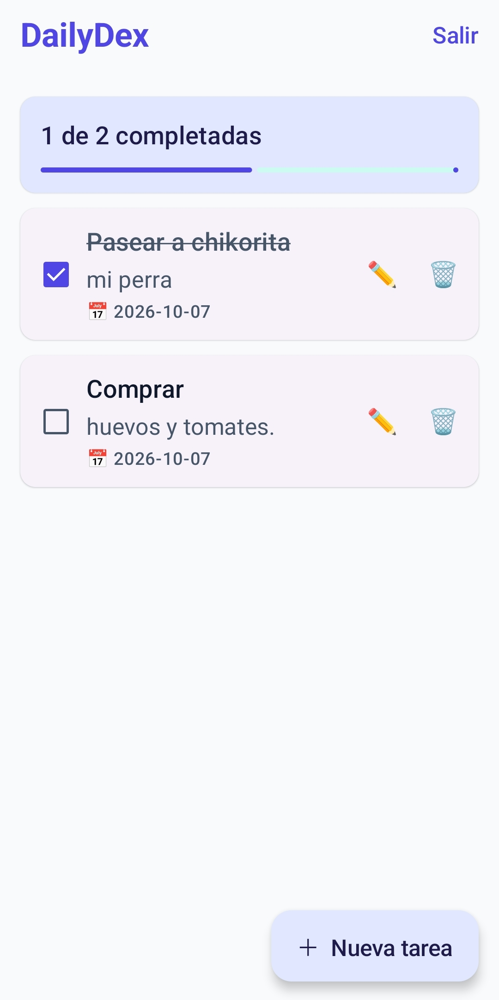
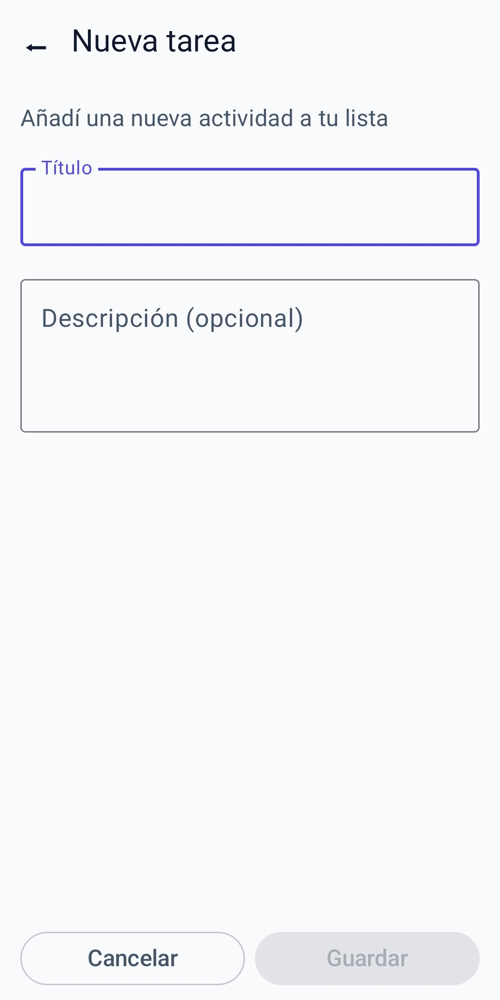
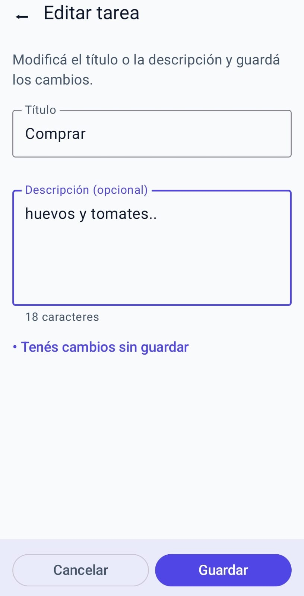
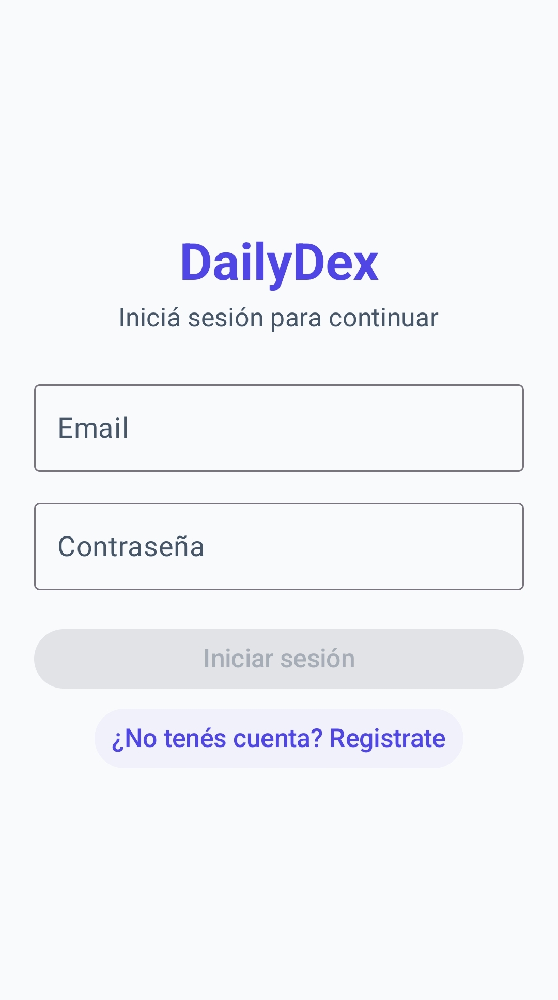

# DailyDex

App de tareas hecha con **Kotlin Multiplatform + Compose Multiplatform** (Android e iOS con el mismo código) y backend en **Supabase**.

## Capturas

| Home | Nueva tarea |
|:---:|:---:|
|  |  |

| Editar tarea | Login |
|:---:|:---:|
|  |  |

## ¿Qué usé y por qué?

- **Compose Multiplatform:** una sola base de código para Android e iOS. No tenía sentido hacer dos apps y mantener dos veces lo mismo.
- **Navegación a mano** (`Routes` + un `when` en `App.kt`): son 3 pantallas, no hace falta una librería entera para eso. A cambio, tuve que resolver yo el botón atrás y las transiciones.
- **Transiciones con `AnimatedContent`:** slide + fade. Como va en `commonMain`, se ve igual en Android e iOS (los XML de animación solo sirven en Android).
- **Botón atrás del sistema:** con `BackHandler`, para que no cierre la app cuando estoy en Crear o Editar.
- **Supabase con Ktor directo al REST:** preferí manejar yo los headers y las respuestas en vez de usar el SDK oficial. Menos magia, más control (aunque más código).
- **Estado con ViewModel + StateFlow** y sin framework de DI: para esta app no hacía falta. Si crece, ahí sí convendría Koin o Hilt.
- **La lista se recarga después de cada operación:** simple y siempre sync con el servidor, sin estados fantasma.
- **Material 3 con tema propio:** consistencia y accesibilidad sin inventar componentes.

### Un par de gotchas

- El `bottomBar` del `Scaffold` de Material 3 **no** aplica los insets de la barra de navegación, así que hay que pedirlos a mano (`windowInsetsPadding(WindowInsets.navigationBars)`) o los botones quedan tapados.
- Con `enableEdgeToEdge()`, cada pantalla es responsable de su propio padding.

## Estructura

```
androidApp/   → entry point Android
iosApp/       → entry point iOS
shared/src/
  commonMain/ → UI + lógica compartida (data, domain, presentation)
  androidMain/ iosMain/ → cosas específicas de cada plataforma
screenshots/  → capturas
```

## Correr las apps

- Android: `./gradlew :androidApp:assembleDebug`
- iOS: abrir [/iosApp](./iosApp) en Xcode y ejecutar.

## Tests

- Android: `./gradlew :shared:testAndroidHostTest`
- iOS: `./gradlew :shared:iosSimulatorArm64Test`
